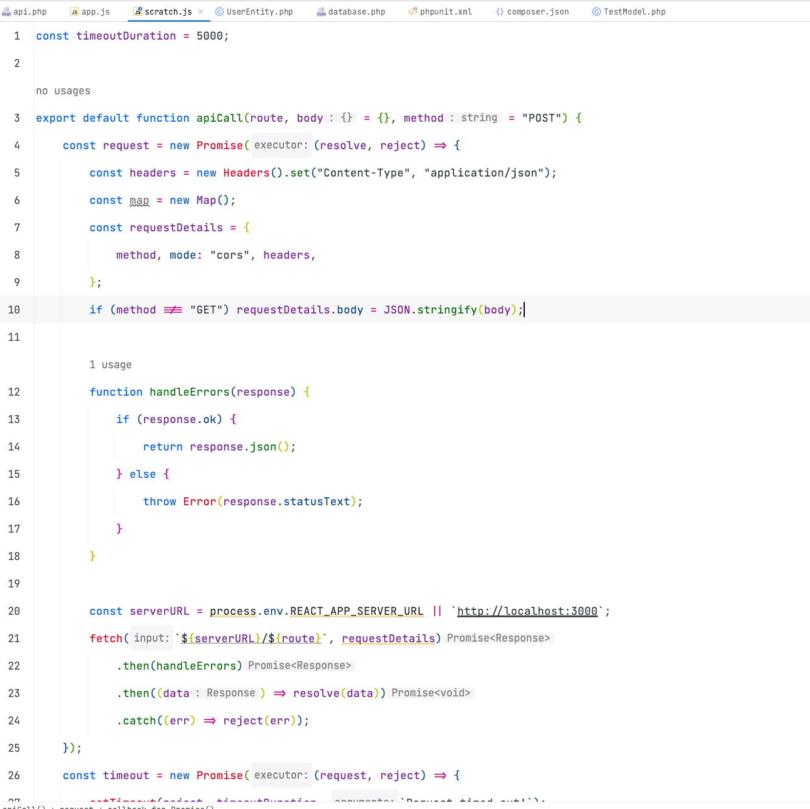

# mimesis-theme

<!-- Plugin description -->
Mimesis - color scheme for Jetbrains products. Is a light theme that offers a clean and elegant look.
It features a combination of minimal and vibrant colors, including shades of blue, magenta, green, and gray. The theme provides good contrast between the background and text, making it easy to read and navigate through code. It also supports a variety of file types, including :
- JavaScript 
- Java/Kotlin
- HTML/CSS 
- Python 
- PHP 
- Rust 
- Go

Mimesis color scheme is well-suited for those who prefer a light and minimalist design for their coding environment.

**Enjoy!**

<!-- Plugin description end -->

## PHP

## JS

## GO 

## Rust 

## Installation

- Using IDE built-in plugin system:
  
  <kbd>Settings/Preferences</kbd> > <kbd>Plugins</kbd> > <kbd>Marketplace</kbd> > <kbd>Search for "mimesis-theme"</kbd> >
  <kbd>Install Plugin</kbd>
  
- Manually:

  Download the [latest release](https://github.com/dyriavin/mimesis-theme/releases/latest) and install it manually using
  <kbd>Settings/Preferences</kbd> > <kbd>Plugins</kbd> > <kbd>⚙️</kbd> > <kbd>Install plugin from disk...</kbd>

---
Plugin based on the [IntelliJ Platform Plugin Template][template].

[template]: https://github.com/JetBrains/intellij-platform-plugin-template
